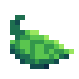

# 

**leaf** (Love's Extensions And Facilities) is collection of libraries and classes for LÖVE. The structure of code and functions' names are entirely based on [Pyxel](https://github.com/kitao/pyxel).

leaf is open source and free to use.

## Features

- Shorter functions' names
- On Key Pressed Once function
- Screen configurator

- Object Platform and Multiple-State Machine Enemy classes
- Physical and graphical tilemap composer
- 2D colision system
- Sprite Animator class

- Save-Load build-in system
- NES-Like resources system

- Simple debug function
- New Table and strings functions

## How to Use

leaf is a single lua file that can be loaded by the `require` function.

```lua
require 'leaf'

leaf.skip('resources')
leaf.init(480, 480, 3)

local x, y = 0, 0

function leaf.step(dt)

    if leaf.btn('a') then x = x - 1
    elseif leaf.btn('d') then x = x + 1 end

    if leaf.btn('w') then y = y - 1
    elseif leaf.btn('s') then y = y + 1 end
end

function leaf.draw()

    leaf.rectb(x, y, 4)
end
```

Do not use love.load | update | draw, it would override the Leaf's functions. Instead, use leaf.load | step | draw.

# API Reference

-`leaf.init(w, h, [s, rz, mw, mh, vs])`<br/>
Sets the screen size (`w` x `h`), the drawing scale (`s`), if the screen is resizeable (`rz`), the min screen size (`mw` x `mh`) and if vsync is enabled (`vs`). Default values: `s = 1, rz = true, mw | mh = s * 2, vs = true`.

 - `leaf.load` <br/>
 Works like `love.load`.

 - `leaf.step`<br/>
 Works like `love.update`.

 - `leaf.late`<br/>
 Called after `leaf.step`.

 - `leaf.draw`<br/>
 Works like `love.draw`.

- `leaf.fps`<br/>
The current fps.

- `leaf.s_wdth`<br/>
The current game screen width (real size / scale).

- `leaf.s_hght`<br/>
The current game screen Height (real size / scale).

## Table
- `leaf.table_first(lst)`<br/>
Returns `idx, itm` of the first item in `lst`.

- `leaf.table_last(lst)`<br/>
Returns `idx, itm` of the last item in `lst`.

- `leaf.table_find(lst, itm)`<br/>
Returns the index of the `itm` if it is in `lst`, otherwise returns `nil`.

- `leaf.table_eq(lst, otr)`<br/>
Returns `true` if `lst` has the same items in the same indexes of `otr`, otherwise returns `false`.

- `leaf.table_copy(lst)`<br/>
Returns an copy of `lst`.

## String
All these functions works with string objects

- `string.split(str, pat)`<br/>
Returns a table of substrings splited by `pat` from `str`, returns `str` if doesn't find `pat`.

- `string.startswith(str, sub)`<br/>
Returns `true` if `str` starts with `sub`, otherwise returns `false`.

- `string.endswith(str, sub)`<br/>
Returns `true` if `str` ends with `sub`, otherwise returns `false`.

## Bool
- `leaf.tobool(val)`<br/>
Converts value to bool. `true` if is `"true"`, `not 0` or `not nil`.

## Debug
Simple print all function.

- `leaf.log(tag, [...])`<br/>
prints `tag` followed by all subsequent values (`...`). e.g.

```lua
leaf.log('debug', true, 4, 6 - 9)

>>> [debug][true, 4, -3]
```

## Graphics
- `leaf.popup(usr, msg)`<br/>
Creates a pop-up window to `usr` with `msg` as content. (Avaliable only on Windows and Linux).

- `leaf.color([r, g, b, [a]])`<br/>
Same of `love.graphics.setColor()`, but it uses 0 to 255 scale, and `a` is optional. If empty, resset the color to default.

- `leaf.rect(x, y, [w], [h])`<br/>
Draws an `w` x `h` rectangle (line draw method) at {`x`, `y`}. If `w` is `nil`, `w` and `h` will be `1`, if only `h` is `nil`, `h` will be `w`.

- `leaf.rectb(x, y, [w], [h])`<br/>
Draws an `w` x `h` rectangle (fill draw method) at {`x`, `y`}. If `w` is `nil`, `w` and `h` will be `1`, if only `h` is `nil`, `h` will be `w`.

## Input
- ESC key<br/>
Quits the application.

- `leaf.btn(key)`<br/>
Returns `true` if `key` is pressed, otherwise returns `false`.

- `leaf.btnp(key)`<br/>
Returns `true` if `key` was pressed at that frame, otherwise returns `false`.

- `leaf.btnr(key)`<br/>
Returns `true` if `key` was released at that frame, otherwise returns `false`.

## Text Class
- `leaf.txt_conf(font, size, speed)`<br/>
Sets the default font as `font`, with size `size` and the class will type 1 letter per `speed` (seconds).

- `leaf.new_txt(tmsg, ypos, [effect], [trigger, tgrTime])`<br/>
Adds a new text object, that will be drawed at height `ypos` and alligned at center acording to the size (better with monospaced fonts). If `trigger` is definided (a `table` with the letter positions) the text will wait `1/tgrTime` seconds before continue. If this text object already exists, nothing happens.

   * `effect = 'noises'` : will draw some red and blue shadows behind the text.

- `leaf.type_txt(dt, [sound])`<br/>
Updates all text objects, playing the tape `sound` if given (See Gramophone).

- `leaf.txt_exist(idxr)`<br/>
Returns `true` if an text object has `idxr` as content.

- `leaf.txt_end(idxr)`<br/>
Returns `true` if the text object that has `idxr` as content has ended.

- `leaf.del_txt(idxr)`<br/>
Removes the text object that has `idxr` as content.

- `leaf.pop_text()`<br/>
Removes all text objects that has ended.

* Text Objects are automatically drawn.

## 2D Vectors
- `leaf.vector([x], [y], [s])`<br/>
Returns a new 2D vector at {`x`, `y`} with optional scale (`s`). If empty, returns a {`0`, `0`} vector.

   - `vector:sum([x], [y])`<br/>
   Sums `x` (or `0`) and `y` (or `0`) to the vector. Returns itself.

   - `vector:sub([x], [y])`<br/>
   Subtracts `x` (or `0`) and `y` (or `0`) from the vector. Returns itself.

   - `vector:mul([x], [y])`<br/>
   Multiplies `vector.x` by `x` (or `1`) and `vector.y` by `y` (or `1`). Returns itself.

   - `vector:mul([x], [y])`<br/>
   Divides `vector.x` by `x` (or `1`) and `vector.y` by `y` (or `1`). Returns itself.

- `leaf.vect4D([lt], [rt], [up], [dn])`<br/>
Returns a 4dir vector with values left (`lt`), right (`rt`), up (`up`) and down (`dn`). If empty, returns all values as `0`.

## Global colliders
- `leaf.add_plat(type, pos, wdt, hgt, name)`<br/>
Adds a new platform of the type `type` (`'solid'` or `'jthru'`) of size `wdt` x `hgt` at `pos` (`vector`), identified by `name`.

- `leaf.coll(pos, coll, [down])`<br/>
Updates `coll` (`vect4D`) with all solid walls near `pos`. Ignore the floor (`coll.dn`) if the platform is `jthru` and `down` is `true`.

- `leaf.del_plat(name)`<br/>
deletes the `name` platform.

- `leaf.draw_plat()`<br/>
Draws all platforms.

## Collectable items
- `leaf.add_itm(name, ipos, sprt, [wall])`<br/>
Adds a collectable item at `ipos`, rendered with `sprt` (`vector`). Will be a solid tile if `wall` is `true`.

- `leaf.catch(coll)`<br/>
Destroys overlapped items by `call` (`vector`) and returns item name if was caught.

## Tile map
- `leaf.tilemap(main, back, info, [obj])`<br/>
Sets the tile map of the game.

  `main` table with the tiles of the main layer.<br/>
  `back` table with tiles at the background (not solid).<br/>
  `info` table with the definition of the tiles.<br/>
  `obj` optional arg. Will spawn this emeny at every `hab` found.<br/>
  e.g.

- `leaf.add_tile(name, spos, sprt, wall)`<br/>
Adds an tile with the indexer `name` at `spos` (`vector`) rendered with `sprt` (`vector`). If `wall` is true, the tile will be solid.

- `leaf.del_tile(name)`<br/>
Deletes the `name` tile.

### Usage
First you have to create a classtype for the tiles.
```lua
function char_to_tile(char, _x, _y)
    local sx = char % 16
    local sy = (char - sx) / 16

    return {
        p = leaf.vector(_y, _x, 8), -- the tile itself position
        s = leaf.vector(sx, sy, 8), -- the sprite position at tilemap.png
        c = char                    -- the byte that represents its sprite
    }
end
```
The byte value is the sprite position converted into a single numeric value (0-255). You can do it using this formula: ``byte = y * 16 + x``.<br/>

Then you'll need to specify what each tile is:
```lua
local info = {
    skipt = {[255] = true}, jthru = {[34] = true}, -- 255 is skiped because it's the empty tile | 34 is the platform tile (jump thru)
    index = {spawn = 254}                          -- this value tells to the tilemapper to return the position of the last occurrence of 254
}
```
After this you can create a table containing all your tiles in your tilemap.
```lua
local map = {
    char_to_tile(255, 0, 0), char_to_tile(055, 1, 0), char_to_tile(255, 2, 0),
    char_to_tile(255, 0, 1), char_to_tile(034, 1, 1), char_to_tile(255, 2, 1),
    char_to_tile(233, 0, 2), char_to_tile(013, 1, 2), char_to_tile(112, 2, 2),
}
```
Also, you can specify an item that can be caught.
```lua
local item = {
    wall = false,                             -- the item isn't solid
    tile = {45, 61},                          -- both 45 and 61 are items
    name = {[45] = 'star_', [61] = 'coin_'},  -- to you be able of accessing it later, name the items with a prefix
}
```
Then just give everything to the tilemapper:
```lua
leaf.tilemap(map, _, info, item)
```

## Platform Object
`leaf.create(otype, ...)`<br/>
Returns a platform object of the `otype`.

* Functions common to all platform types.

- `platform:step(dt, [cpos])`<br/>
Updates `platform` object (moviment, collision, animaiton). If `platform` is an `pm-ghost`, the object will haunt the `cpos` position (`vector`).

- `platform:draw()`<br/>
Draws `platform` object. If object has no animator, a rectangle will be drawn instead.

- `platform:get_pos([scale])`<br/>
Returns a `vector` with the current position of `platform`. The `s` parameter will be used as scale, if given.

- `platform:set_pos(npos)`<br/>
Sets the `platform` position to `npos` (`vector`).

- `platform:get_stt()`<br/>
Returns the current animation state of `platform` (`idle` or `moving`).

- `platform:get_yac()`<br/>
Returns current `Y` axis acceleration.

- `platform:can_jmp()`<br/>
Returns count of remained jumps of object or if it can jump (boolean).

- `platform:jumped()`<br/>
Returns `true` if `platform` has jumped at that frame.

- `platform:on_wall()`<br/>
Returns `true` if the `platform` is leaning against a horizontal wall.

- `platform:landed()`<br/>
Returns `true` if the `platform` is landed.

- `platform:get_mrr()`<br/>
Returns the mirror state of `platform`. `-1` if sprite is flipped, `1` if it's not.

### platform
`(ipos, ctrl, [def])`<br/>
Returns a playable object, instantiated at `ipos`, using `ctrl` as key definition. `def` is used do give an animator object and physics parameters. e.g.
```lua
local ctrl = {

    lft = 'left' , -- move to left
    rgt = 'right', -- move to right
    dwn = 'down' , -- climb down

    int = 'up', -- interact
    ups = 'x' , -- jump
    atk = 'c' , -- atack
}

local def = {

    speed = 1.5,         -- moviment speed
    anim  = leaf.anim(), -- animator object
    clip  = {

        jump = leaf.asrc('def-jump', 0, 6),       -- jumping animation clip
        fall = leaf.asrc('def-fall', 0, 7),       -- falling animation clip

        idle = leaf.asrc('def-idle', 0, 0, 4),    -- idle animation clip
        walk = leaf.asrc('stp-walk', 0, 4, 0, 5), -- walking animation clip
        size = 8, 				  -- object size (value x value)
        mass = 8,				  -- the object weight

        jump_count    = 2,    -- Count of jumps
        jump_strength = -200, -- Jump strength
    }
}

local char = leaf.create('platform', leaf.vector(0, 0), ctrl, def)
```

## pm-ghost
`(min, max, pos, [clip])`<br/>
Platform Packman-like enemy. Runs the area from `min` to `max`, but is instantiated at `pos`. If defined, the `clip` will be used as an animator object, containing the idle and angry animation clips. e.g.
```lua
clip = {

    -- Same name to change only sprites --
    idle  = leaf.asrc('idle', 2, 0, 4),
    angry = leaf.asrc('idle', 2, 5, 9),
}

ghost = leaf.create('pm-ghost', 0, 32, leaf.vector(0, 0), clip)
```

## Resources
Leaf uses two png files ("tilemap.png" to the tilemap class and "sprites.png" to animator objects) in `resources/` as graphic sources and all files in `tracks/` as audio souces. The graphic files will be automaticly loaded, except if you use `leaf.skip('resources')`.

## Animator Object
Animation class, responsible for controlling and animating sprites.

- `leaf.anim([frame])`<br/>
Returns an animator object. If `frame` (`vector`) is specified, the animator will be initialized in this frame.

- `leaf.asrc(name,  ...)`<br/>
Returns an animation source, taged with `name`, that can hold a prefix that specify the animation type.
   * `('def-name', rw, fx, lx, [opt])`<br/>
   Default type, the same without a prefix. Returns a sprite sheet animation source, in the `rw` row, from the` fx` to `lx` columns. If `opt` (`{spr, cnt}`) is specified, optional frames (`spr`) will be appended at the end of the animation `cnt` times.

   * `('stp-name', rw, fx, mx, lx)`<br/>
   Stepped type. Returns a sprite sheet animation source, interleaved animation of fx and lx separated by mx (`{fx, mx, lx, mx}`).

- `anim:play(dt, anim, speed, loop)`<br/>
Causes object `anim` to play animation` anim` at speed `speed` (frames per second). If `loop` is specified, the animation will be looping.

- `anim:loop()`<br/>
Causes object `anim` to loop the current animation.

- `anim:draw(pos, side)`<br/>
Draws the current animation of `anim` at `pos` (`vector`). If `side` is smaller than 0, the sprite will be flipped, if it's greater, will not.

## Gramophone
- `leaf.playlist(main, back, ...)`<br/>
Sets the playlist of audio souce. `main` (`tracks/<main>`) is the main music layer, `back` is the background environment. `...` is all other play-once sounds of the game (sfx), like soundsteps, hits, etc. * Max 8 tracks (0 to 7).

- `leaf.gramo.theme()`<br/>
Starts playing the main and background musics.

- `leaf.gramo.set(thm, stt)`<br/>
Sets playing status of `thm` (`'main'` or `'back'`) to `stt` (boolean).

- `leaf.gramo.play(tape, track, loop)`<br/>
Plays `tape` (indexed in `leaf.playlist`) at sound layer `track`. If `loop` is true, `tape` will play in looping. The volume will be set to `track / 7`.

- `leaf.gramo.pause(track)`<br/>
Pauses `track` if it exists.

- `leaf.gramo.resume(track)`<br/>
Resumes `track` if it exists.

- `leaf.gramo.fade_in(track, speed)`<br/>
Increases the volume of `track` from 0 to 1 in `speed` (percent per second).

- `leaf.gramo.fadeout(track, speed)`<br/>
Decreases the volume of `track` from 1 to 0 in `speed` (percent per second).

## Serializable data
- `leaf.save_data(file, data, [method, msg])`<br/>
Saves a file named `file` containing the data of `data` (string, number or table) in the standard LÖVE directory, using an optional method.
   * `method = nil`<br/>
   Standart method. Save all data inside a .lua file.

   * `method = 'safe'`<br/>
   Magic method. Saves the file as `file` and store the data in a slightly difficult way to change it. It usually causes errors of nullity if done (not sure why). It also adds `msg` as a message at the top of the file.

- `leaf.load_data(file, method)`<br/>
Returns the content of `file`. If an method was used to save the file, it must be specified with `method`.
